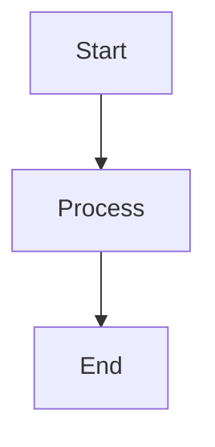

# Mermaid Markdown Preview Server

A **very opinionated** markdown preview server designed to simplify reading and presenting markdown files with Mermaid diagrams. Perfect for technical documentation, architecture diagrams, and flowcharts.

This tool makes specific choices about rendering, layout, and diagram presentation to optimize for readability and professional output.

## Why This Tool?

This tool was specifically created to enhance the Mermaid diagram viewing experience:

- **Preserves aspect ratio** - Mermaid diagrams maintain their proper proportions
- **Optimal screen usage** - Diagrams scale up to 90% of vertical screen space for better visibility
- **Pan & zoom controls** - Interactive navigation for large, complex diagrams
- **Print-friendly** - Formatted for clean PDF export and printing

## Features

- **Mermaid diagram support** with interactive pan & zoom capabilities
- **Auto-reload on file changes** - automatically refreshes when markdown files are modified
- **Syntax highlighting** for multiple languages:
  - TypeScript, JavaScript, Elixir, SQL, JSON, Bash, and more
- **Clean, GitHub-style rendering** for professional documentation
- **Development mode** with TypeScript auto-rebuild on source changes

## Installation

### NPM (Recommended)

Install globally from npm:

```bash
npm install -g markdown-preview-server
```

Then use the `markdown` command:

```bash
markdown <path-to-markdown-file.md>
```

### From Source

Clone the repository and install dependencies:

```bash
git clone https://github.com/andrelip/mermaid-markdown-render.git
cd mermaid-markdown-render
npm install
npm run build
```

## Usage

### Basic Usage

If installed via npm:

```bash
markdown <path-to-markdown-file.md>
```

If running from source:

```bash
npm start <path-to-markdown-file.md>
```

Example:

```bash
markdown example.md
```

The server will:

1. Start on `http://localhost:4002`
2. Automatically open your browser
3. Render your markdown file with syntax highlighting
4. Watch for file changes and auto-reload

### Using Mermaid Diagrams

Simply include Mermaid diagrams in your markdown using code blocks:

````markdown

````

Features:

- **Click and drag** to pan around large diagrams
- **Scroll to zoom** in and out
- Diagrams automatically scale to use up to 90% of screen height
- Aspect ratios are preserved for accurate representation

## Auto-Reload

The server watches for changes and automatically updates the preview!

### Standard Mode

```bash
markdown <path-to-markdown-file.md>
# or from source:
npm start <path-to-markdown-file.md>
```

- **Markdown file**: Changes are automatically detected and the preview updates instantly
- **Source code files**: Not watched

### Watch Mode (Development - Source Only)

For development on the tool itself:

```bash
npm run watch <path-to-markdown-file.md>
```

- **Markdown file**: Auto-reload on save
- **Source code files** (`src/*.ts`): Automatically rebuilds TypeScript and reloads the browser

Simply edit your markdown file and save - the browser will automatically refresh to show your changes!

## Exporting and Printing

The rendered output is optimized for PDF export and printing:

1. **Export to PDF**: Use your browser's "Print to PDF" function (Ctrl/Cmd + P)
2. **Print**: Direct printing maintains clean formatting and diagram quality
3. **Professional formatting**: GitHub-style rendering ensures documents look polished

The layout is specifically designed to ensure Mermaid diagrams and code blocks render correctly in printed/PDF format.

## Development

### Quick build and run:

```bash
npm run dev <path-to-markdown-file.md>
```

### Development with auto-rebuild:

```bash
npm run watch <path-to-markdown-file.md>
```

This enables watch mode where both markdown AND TypeScript source changes trigger automatic rebuilds and browser refresh.
